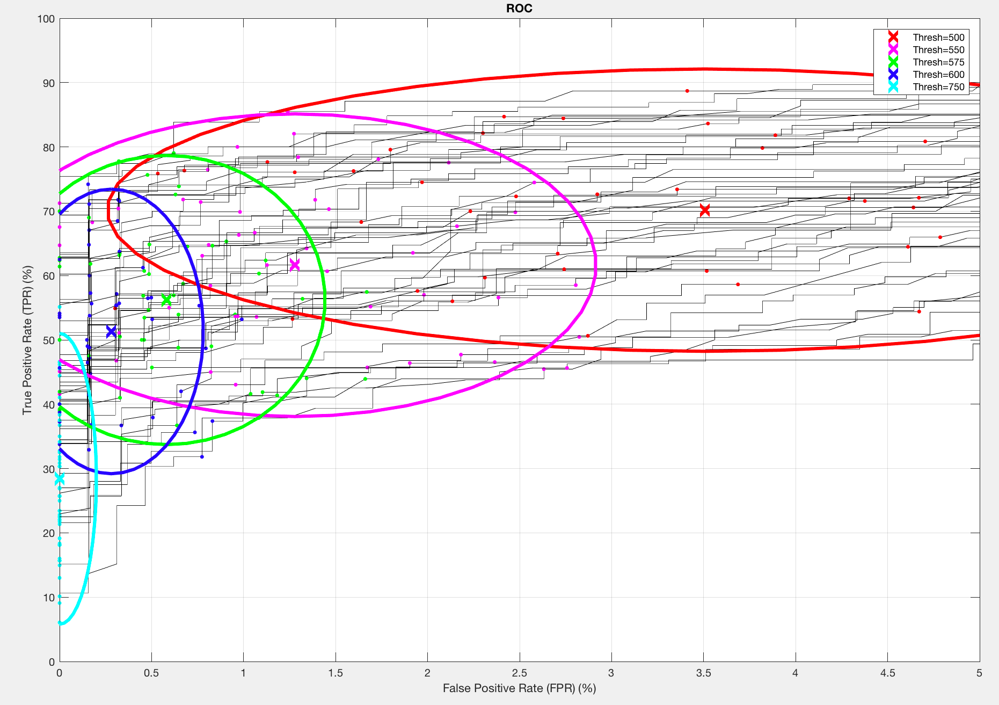

#FaceEval Overview

The FaceEval tool is meant to support testing and evaluation of our face detection and recognition system when we add data, make changes, or even adopt a new underlying library or approach. Hopefully it helps support data-driven decisions and tuning, so we can quantify performance in a meaningful way. 

The actual tool binary is `cti_vision_face_eval` and the `main()` for it is in [faceEval.cpp](faceEval.cpp). It supports three modes, selectable by command line arguments: Detection, Identification, and Confusion. (Note that multiple modes can be run in the same call.)

All modes read images from some root directory (specified with the _required_ `--rootDir` argument), for example `~/DropBox/Data-Collection/Raw/faces/single`. 

## Detection

This simple mode, selected by `--detection`, runs the face detector on a set of images, _assumed_ to have a single face in them and an optional set of "background" images assumed to have no faces in them. It simply reports false postives and false negatives. It can also record whether facial parts were found for detected faces.

Since we only have OKAO face libraries, several of the options currently available are fairly specific to those libraries and testing their abilities/parameters.

### Confusion

This mode is selected by `--confusion` and enrolls each individual face from a set of images as its own "record". It then does pairwise comparison between all pairs, to generate a confusion matrix. This test avoids the complexities of having multiple enrollment images for a given face, and is meant to be a somewhat lower-level test of facial feature discrimination power.

The given image files are assumed to be organized such that each sub-directory of images is the same person, so the test knows which pairs should be matches and which should not. Thus, it can report true and false positives. The complete results are also stored in a CSV file `confusion_results.txt`. Note that `--minEyeDistToEnroll` and `--maxHeadAngleToEnroll` options can be used to control whether faces are enrolled or not (to require a certain level of "quality" of image for enrollment).

### Identification

This mode is selected by `--identification` and is a more "complete" recognition test. Like the Confusion test, it assumes all images in each sub-directory are of the same person. It additionally requires a `enrollList.txt` file in that sub-directory, to specify which images should be used for enrollment (and the others are used for testing). It can be run multiple times using `--numRuns`, selecting a different set of enrollees each time (where the maximum number of enrollees is specified by `--maxEnrollees`). All images not used for enrollment are used as test images. 

Detailed results are written to `identification_results.txt` and there is a [Matlab script](displayRocResults.m) to parse and display that in a crazy graphy like this one:

We used the above to select the new OKAO recognition threshold of 575 based on the tradeoff and relatively low variance of the green result.

### Command-Line Argument Parsing

A [SimpleArgParser](simpleArgParser.h) class is used to support very, very basic command-line argument parsing. It is designed with simplicity and ease of use over being full-featured. So it does very limited error checking (beyond simply reporting _after a run_ if any supplied arguments were not used) and does not really support any "help" options since it does not require "registering" command line args. Arguments are simply stored as raw strings and retrieved as needed using `GetArg()` wherever the argument is used.

A hack to see available `--` arguments used in the code is to run the `faceEvalHelp.sh` script. It just parses the code and display instances of `GetArg()` with `--arg` anywhere in the code.

### Display

The `IFaceEval` interface supports some display modes (and actual display helpers) for displaying certain subsets of results while running the test (for debugging and finer-grained understanding of failures vs. successes). These can be specified on the command line using `--enableDisplay` and a string corresponding to one of the following enumerated modes:

  - `Off`: No display (default)
  - `All`: Display the face (or lack thereof) in every image or recognition pair
  - `AnyFailure`: Only display if something failed (face not detected when it should have been, recognition failure, etc)
  - `NoFailure`: Only display successes 
  - `FalsePositives`: Only display false positives for the given mode (detecting a face that shouldn't be there for Detection, or an incorrect match for Recognition)
  - `FalseNegatives`: Only display false negatives for the given mode (not detecting a face that is there for Detection, or not matching an enrolled face for Recognition)
  - `MissingParts`: In Detection mode, display only those faces for which parts were not found.