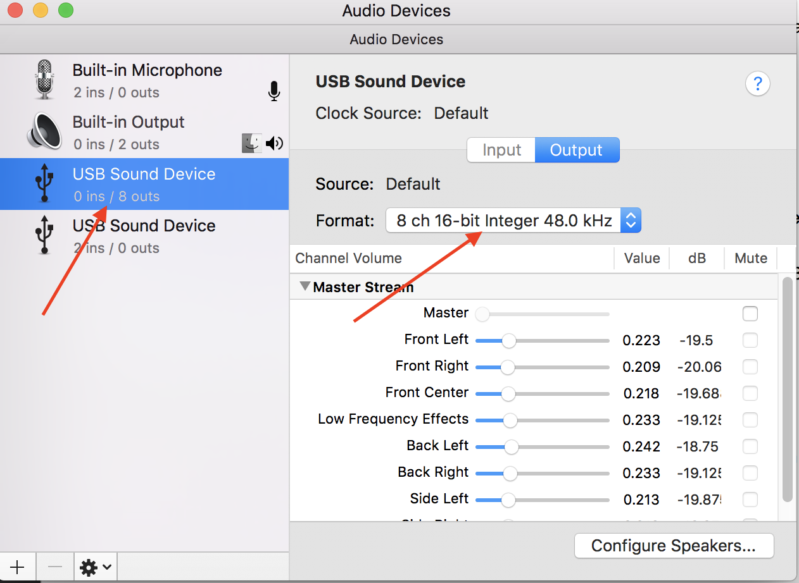

# MiniSquawks

MiniSquawks is an audio interface to play audio files from a computer, to 8 connected speakers. This is mainly used for directional testing for Victor/Vector but can be re-purposed for other uses.

# What you'll need
1. Computer that is running Mac OS
2. [StarTech 7.1 USB sound card](https://www.amazon.com/StarTech-com-Adapter-External-Digital-ICUSBAUDIO7D/dp/B002LM0U2S/ref=pd_sim_147_1?_encoding=UTF8&pd_rd_i=B002LM0U2S&pd_rd_r=4CWTD6YTQZ2G80XSB1JE&pd_rd_w=PAjpn&pd_rd_wg=TYS9q&psc=1&refRID=4CWTD6YTQZ2G80XSB1JE). (Just one)
3. [Stereo to Mono audio splitters (You'll need 4)](https://www.amazon.com/Hosa-YMM-261-Stereo-Breakout-Cable/dp/B000068O5H/ref=sr_1_9?s=electronics&ie=UTF8&qid=1525102593&sr=1-9&keywords=stereo+splitter+3.5mm). If you're not getting this exact brand, be *very* sure that what you get splits Stereo to Mono channels!
4. [Speakers (Up to 8)](https://www.amazon.com/gp/product/B00FJILVDS/ref=oh_aui_detailpage_o02_s00?ie=UTF8&psc=1). Doesn't really matter what kind, just make sure it can connect to 3.5 mm audio jacks (head phone jacks)
5. [Male to Male audio cables](https://www.amazon.com/TNP-Premium-Plated-3-5mm-Audio/dp/B019SSZHGQ/ref=sr_1_2?ie=UTF8&qid=1519848631&sr=8-2&keywords=35mm%2Baudio%2Bcable%2Bmale%2Bto%2Bmale&th=1). Up to 8, depending on how many speakers you're using.

# Things to install

In the Victor github repo, you'll want to first pull from master, and then checkout the branch 

`aghirmai/BI-990-Squawkbox-repurposed-for-24Audio-Room` 

You will need to also download the following through your Mac terminal

`brew install portaudio` (this one takes a while)
`pip3 install pyaudio`
`pip3 install easygui`

Once you've installed those, you'll need to configure the USB sound card (this is a one time thing).

1. Plug in the sound card to your Mac computer
2. Open up "Audio MIDI setup"
3. You should see "USB Sound Device" appear. Select the one with `0 ins/2 outs`
4. There will be a dropdown `Format`. Select the option `8 ch 16 bit Integer 48.0 kHz`

# Running the script
While you're in the victor repo, navigate into the squawkbox folder, it'll be 

`victor/tools/squawkbox`

To run the script, you'll need to type in 
`python3 24AudioGUI.py`

The program won't continue until it detects a sound card plugged in (there will be a message on the terminal that you ran the program)

You'll then be prompted with information for running audio. 

**Important thing to note with the sound card.** If you don't have audio splitter cables, then you won't actually be getting all 8 speakers to play. Even worse, if you accidentally got splitter cables that goes from one stereo to *two* stereo out, you'll just end up with 2 speakers playing at once rather than just the one you want
